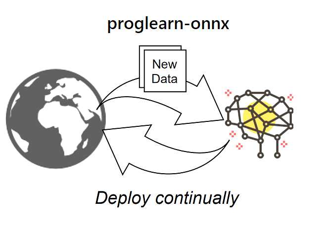

<!--- SPDX-License-Identifier: Apache-2.0 -->
<p align="center"></p>

[](https://github.com/psf/black)

## Introduction
*proglearn-onnx* converts [ProgLearn](https://github.com/neurodata/ProgLearn) models to [ONNX](https://github.com/onnx/onnx).
Once in the ONNX format, you can use tools like [ONNX Runtime](https://github.com/Microsoft/onnxruntime) for high performance scoring.
All converters are tested with [onnxruntime](https://onnxruntime.ai/).

## Supported Converters
This version implements `ProgLearn` estimators that adhere to the [sklearn-onnx](https://onnx.ai/sklearn-onnx/) API on registering custom converters:

| Name| Package | Supported |
|  :----------------  |  :------:  |  :----:  |
| ClassificationProgressiveLearner | progressive_learner| **Yes** |
| LifelongClassificationForest | forest | **Yes** |
| LifelongClassificationNetwork | network| **No** |

## Installation
You can install from [PyPi](https://pypi.org/project/prog2onnx/):
```
pip install prog2onnx
```
*Note*: There is a known backtracking issue in `pip`'s dependency resolver that may significantly affect the time required to fetch the correct versions of the dependencies. A quick and easy fix is to add `--use-deprecated legacy-resolver`
at the end of `pip install`.   
## Getting started

```python
# Train a model using 3 tasks.
import numpy as np
from sklearn.datasets import load_iris
from sklearn.model_selection import train_test_split
from proglearn.forest import LifelongClassificationForest

iris = load_iris()
X, y = iris.data, iris.target
X = X.astype(np.float32)
X_train, X_test, y_train, y_test = train_test_split(X, y)

clr = LifelongClassificationForest(default_n_estimators=10)

for _ in range(3):
	clr.add_task(X_train, y_train)

# Convert into ONNX format.
from prog2onnx import Prog2ONNX

p2o = Prog2ONNX(clr)

# Convert for task_ID = 0
onx = p2o.to_onnx(0)

# Validate ONNX model (Optional) 
p2o.validate()

# Save ONNX model to file (Optional) 
p2o.save("forest_iris_0.onnx")

# Compute the prediction with onnxruntime.
import onnxruntime as rt

sess = rt.InferenceSession(onx.SerializeToString(), providers=["CPUExecutionProvider"])
input_name = sess.get_inputs()[0].name
pred_onx = sess.run(None, {input_name: X_test.astype(np.float32)})[0]
```
## Testing
Several scenarios are assessed in the form of separate tests using Python's built-in `unittest` testing framework. 

`python -m unittest -v tests/test_proglearn.py`

## Contribute
We are open to contributions in the form of feedback, ideas, or code.

## License
[Apache License v2.0](LICENSE)
